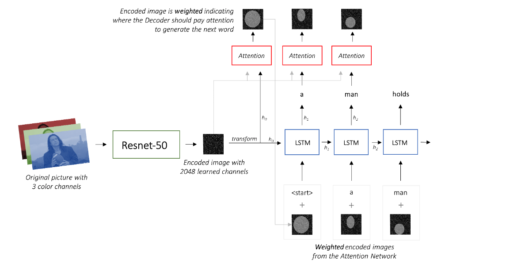

# ImageCaptionProject

## Introduction:
Image captioning is a task for generating textual description of an image. for example:

  

### Previous work:  
There is a lot of approaches and trials to approach the task, the most celebrated ones are referred to bellow, most of the work done in the last years is a combination of those works.
1.	Andrej Karpathy Ph.D. work was done about image description:
[***Deep Visual-Semantic Alignments for Generating Image Descriptions***](https://cs.stanford.edu/people/karpathy/cvpr2015.pdf)
the work mostly showed the idea of RCNN, scoring method and the idea to build the sentence by looking at different parts of the image.
2.	Google builds on the previous work using LSTM instead of plain RNN and beam search:
3.	Microsoft architecture added the ability to identify landmarks and celebrities:
[***Rich Image Captioning in the Wild***](https://www.microsoft.com/en-us/research/wp-content/uploads/2016/06/ImageCaptionInWild-1.pdf)

### Scope
All The above models are based upon an architicture which consists of a CNN that learns a feature-map followed by an RNN that generates the caption:

  

In this project we will implement a model which is based on: 

[***Show, Attend and Tell***](https://arxiv.org/pdf/1502.03044.pdf)
where soft attention mechanism has been added to the architicture, which at each time-step the models learns *where to look*. 

  

## Overview:
Our model is a decoder-encoder which have 4 main parts: 
1. A convolutional neural network that extracts features
from the images (Encoder) - for this part we decided to use a pretrained **Resnet-50**
2. an attention mechanism that weights the
image features - 
3. Embeddings for the tokens in the captions -  [*Pre-trained word embeddings*](https://pytorch.org/text/stable/vocab.html#glove) added as optional
4. An RNN that generates captions to
describe the weighted image features (Decoder) - We will use an LSTM 

  

This model can be trained end-to-end using backpropogation, however we will freeze the Encoder weights and use the learned feature map from the pretrained model