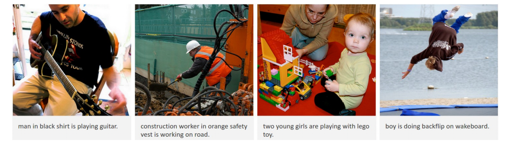

# ImageCaptionProject

## Introduction:
Image captioning is a task for generating textual description of an image. for example:

  

### Previous work:  
There is a lot of approaches and trials to approach the task, the most celebrated ones are referred to bellow, most of the work done in the last years is a combination of those works.
1.	Andrej Karpathy Ph.D. work was done about image description:
[***Deep Visual-Semantic Alignments for Generating Image Descriptions***](https://cs.stanford.edu/people/karpathy/cvpr2015.pdf)
the work mostly showed the idea of RCNN, scoring method and the idea to build the sentence by looking at different parts of the image.
2.	Google builds on the previous work using LSTM instead of plain RNN and beam search:
3.	Microsoft architecture added the ability to identify landmarks and celebrities:
[***Rich Image Captioning in the Wild***](https://www.microsoft.com/en-us/research/wp-content/uploads/2016/06/ImageCaptionInWild-1.pdf)

### Scope
All The above models are based upon an architicture which consists of a CNN that learns a feature-map followed by an RNN that generates the caption:

  

In this project we will implement a model which is based on: 

[***Show, Attend and Tell***](https://arxiv.org/pdf/1502.03044.pdf)
where soft attention mechanism has been added to the architicture, which at each time-step the models learns _where_ _to_ _look_. 

  

## Overview:
The model make use in the idea of *transfer learning*, *encoder-decoder architecture* and *attention*.
The forward action of the model consists of two parts, Encoder and Decoder.
The Encoder is a CNN that takes image as an input and extract its features. The features will be the last layer before the final output layer.
For purposes of efficiency, we will use pretrained model of resnet50 and use its output features as the input for the decoder. 

While the Decoder part will be LSTM instead of plain RNN layer.
The output of the decoder then goes into the Decoder that in addition receive the sentence that describing the photo in case it is the training part or the generated sentence so far in case of prediction.

